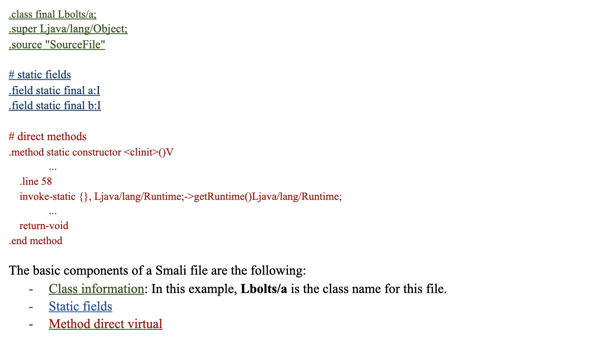
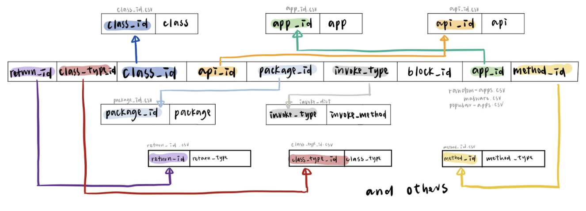
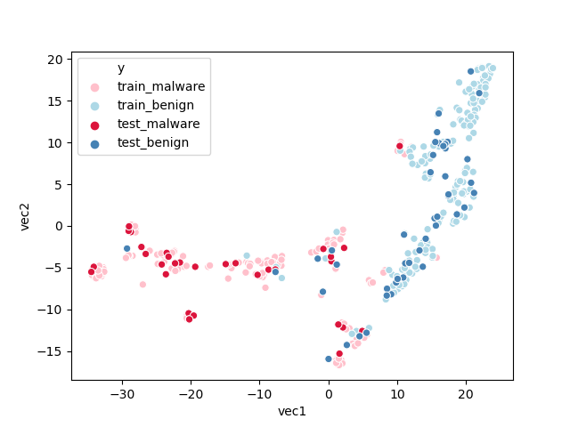
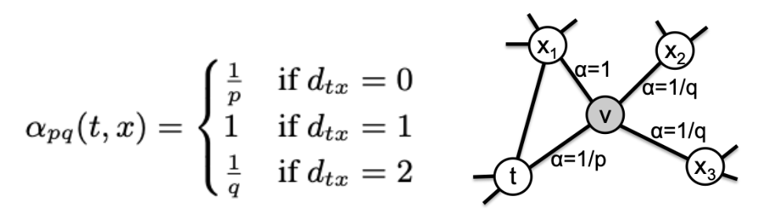
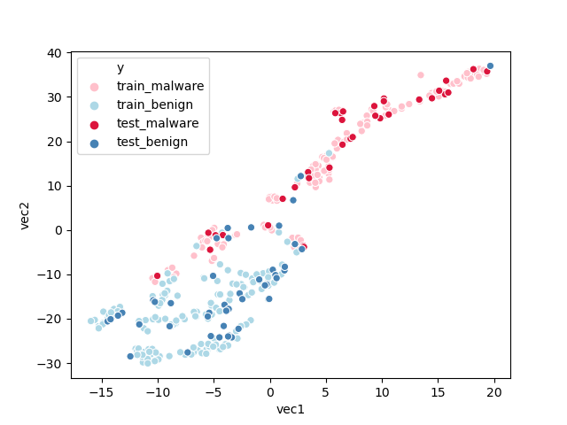
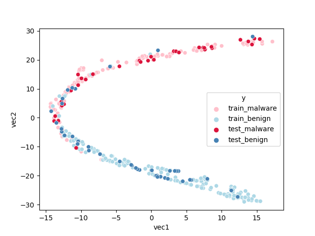

Malware Detection
Authors: [**Yikai Hao**](https://github.com/YikaiHao), [**Yu-Chieh Chen**](https://github.com/yuc399), [**Ruoyu Liu**](https://github.com/rul141)

[Check on GitHub Repo](https://github.com/YikaiHao/DSC180_Winter)

## Introduction 
As the internet techniques are growing at a fast speed nowadays, people are starting to worry about their data safety. Since many of us will store our important information on our cellphones, we need to find an appropriate way to secure our cell phone away from malwares. It is also large companies’ like Google who offer a third open market to ensure the data security of their customers. Therefore, more researchers are participating in the research area of detecting malwares. There is a new method called HinDroid, which finds out the relationships between applications for malware detection. However, while using the HinDroid, some shortages of the model have been found. For example, the HinDroid only uses parts of the features contained in the smali file. But there are more useful features that can help detect malwares after doing analysis. There are also other models which relate to NLP that are popular in the malware detection research domain. Therefore, in this report, we will compare the performance of HinDroid, Word2vec, Node2vec, and Metapath2vec.

## Data Generating Process
### Data Source 
The data source is called AnDroid Malware Dataset (AMD). The dataset is published in 2017 by the Argus Lab from the University of South Florida. This data source is used by many other malware detection papers and widely used in the research domain. 
### Data Description 
The original source is the APK(Android Application Package), which can be decompiled by Apktool. After converting the APK package into different files, we select smali files specifically for detecting malwares. Smali files are a type of file converted from the original java code. The researchers considered that the malicious actions are contained in the smali file and it is more meaningful to use smali files. We randomly choose 200 malwares and 200 benigns from the dataset.
### Smali File 
In order to analyze the smali files, we should understand the structure of it. Therefore, here is the description of the smali files and the features contained in the smali files.

### API Calls
In order to understand which part of the smali files do the malicious action, we put our attention on API (Application Programming Interface) calls. There are four main components in an API call.

### Data Extraction 
After understanding the data structure of the data source and the exact data section we want to focus on, we start the data extraction process. We decide to use api name, class type, package type, code block number, method type, return type, and invoke type to be our features. Those features almost include every kind of information we can get from the smali file. In addition, we also do some EDA(Exploratory Data Analysis) to make sure every feature we get is distributed differently among different types of applications. Therefore, the features can present the original data and they are useful hints to detect malwares.
### Database
We design a special database to store the data we get. Since the main feature is the api, there are over 2 millions unique apis and more than 50 millions apis appeared in different smali files. Separated csv files and unique ids are used to store the specific unique string values and represent the string value. Then, in the main csv files, we store the unique ids from different references. This will reduce the space and time. The description of our database is appended below.

## Model 
### HinDroid
HinDroid is the baseline model we use for our report. It contains different types of kernels and the meaning behind each kernel is different. It uses the features we extract from the data generating process to build some matrices. Each matrix shows a type of relationship between apis or applications. By choosing different types of matrices we want to combine together, we get the kernel we have. Then we will be able to use the kernels for malware detection.

The four types of matrices are: A, B, P, and I matrices. 
- A matrix shows the connection among apis and applications. The value within the A matrix will be one if the application contains the api.
- B matrix shows the connection between apis. The value within the B matrix shows whether two apis are contained in the same code block.
- P matrix also shows the connection between apis. The value within the P matrix shows whether two apis use the same package.
- I matrix shows the connection within the apis. The value within the I matrix shows whether two apis use the same invoke type.

Currently, due to the large size of the unique apis we get, we are not able to calculate out the I matrix yet. Therefore, the kernel we have now is AA^T, ABA^T, APA^T, and APBP^TA^T. 
### Word2Vec
Word2vec is the new model we generate. This model is a powerful NLP model to help us find not only the direct relationship between apps but also the cluster connection between apps using the graph, which is a different approach to solve the malware detection problem with HinDroid. 

Our Word2vec takes AA^t as an input and builds a graph based on the AA^t. Therefore, the graph contains two components - applications and apis. We then generate sentences as our input for the Word2vec model. Firstly, we randomly pick an app out, then we follow the path in the graph to search for the next api and app. We will end our path with an app. After finishing the sentence generating process, we will implement the genism’s Word2vec model to get our vector embeddings for every application and api. The final vector embeddings will be easily used in different machine learning models.  

We use data visualization to check if our model makes sense. Our plot shows the vector embeddings after the dimension reduction. As the graph shows, the distribution of malwares and benigns are separated. Benigns are condensed at the left side with small x and y values. However, malwares are distributed at the right side, with a large x value and widespread y value. From the information on the graph, the model can detect malwares well.  

### Node2Vec
The only difference between Node2vec and Word2vec is the random walk procedure. This change improves the inability of Node2vec and tracks the path with no specific rules about where to go. 

We use all A, B, and P matrices to build our Node2vec. Since the B and P matrices both represent the relationships between apis, we combine the two matrices into one larger matrix to replace the B and P matrices. The values within the large matrix represent whether two apis have some relationships, no matter whether they are within the same code block or use the same package. 

For the probability of random walks, there are three types of probability. For example, we have a path from t -> v. When choosing the next step for v, we have three different probabilities. If we get from v -> t, we have a probability of 1/p. In addition, if the next node from v has a connection with t, then the probability of the node will be 1. Other nodes will have a probability with 1/q. We then implement sentences into the genism’s Node2vec model.

Similar to Word2vec, we also plot out the vector embeddings after finishing the dimension reduction. The plot we get is shown below:

### Metapath2Vec
The difference between Metapath2vec and Node2vec is that the Metapath2vec assigns specifically about where to go for the next step. We use A, B and P matrices for our Metapath2vec. For example, if our path given is ABA, we will generate a sentence from an app to an api first. Then we will check the next node is an api which is in the same code block with the previous api. Finally, our path will go to another app. We repeat this loop until we reach the maximum length we set or have no next node. We then implement sentences into the genism’s Metapath2vec model.

After the dimension deduction process is done, the embedding plot is shown below:

## Result 
Below are the results of different models. 

### Classifiers
After different models are built, we choose SVM, Random Forest, and Gradient Boosting as our classifiers while doing the final malware detection. The classifier with highest accuracy will be chosen as the classifier of a specific model. As the result table shows, most classifiers will be SVM. However, the Node2Vec model shows a preference on Gradient Boosting.

### Result Tables 
As the tables show below, train accuracy, test accuracy, and F1 score are the values to evaluate the performance of the model. For HinDroid, the AA kernel and the APA kernel have the best performance. And the AA kernel of Word2Vec has the best performance among Word2Vec, Node2Vec, and Metapath2Vec. Overall, the HinDroid model performs better than other models. Therefore, we will continuously make improvements on the HinDroid model to create a stronger model for malware detection.

#### HinDroid

| Metapath | Train_Acc | Test_Acc | F-1 Score | Model |
|----------|-----------|----------|-----------|-------|
| AA       | 1.0       | 0.9677   | 0.9655    | SVM   |
| ABA      | 0.9407    | 0.8602   | 0.8506    | SVM   |
| APA      | 1.0       | 0.9624   | 0.9770    | SVM   |
| APBPA    | 0.9218    | 0.8602   | 0.8488    | SVM   |

#### Word2Vec

| Metapath | Train_Acc | Test_Acc | F-1 Score | Model |
|----------|-----------|----------|-----------|-------|
| AA       | 0.9969    | 0.95     | 0.9459    | SVM   |

#### Node2Vec: 

| Metapath | Train_Acc | Test_Acc | F-1 Score | Model             |
|----------|-----------|----------|-----------|-------------------|
| AA       | 1.0       | 0.9375   | 0.9333    | Gradient Boosting |
| All      | 0.9781    | 0.8625   | 0.8608    | Gradient Boosting |

#### Metapath2Vec

| Metapath | Train_Acc | Test_Acc | F-1 Score | Model         |
|----------|-----------|----------|-----------|---------------|
| AA       | 0.997     | 0.925    | 0.927     | SVM           |
| ABA      | 0.997     | 0.875    | 0.875     | SVM           |
| APA      | 0.984     | 0.9125   | 0.907     | SVM           |
| ABPBA    | 0.9563    | 0.8625   | 0.8608    | Random Forest |

## References 
[1] Hou, Shifu and Ye, Yanfang and Song, Yangqiu and Abdulhayoglu, Melih. 2017. HinDroid: An Intelligent Android Malware Detection System Based on Structured Heterogeneous Information Network. 

[2] Mikolov, Tomas and Corrado, Greg and Chen, Kai and Dean, Jeffrey. 2013. Efficient Estimation of Word Representations in Vector Space.  

[3] Grover, Aditya and Leskovec, Jure. 2016. node2vec: Scalable Feature Learning for Networks.  

[4] Dong, Yuxiao and Chawla, Nitesh and Swami, Ananthram. 2017. metapath2vec: Scalable Representation Learning for Heterogeneous Networks  
