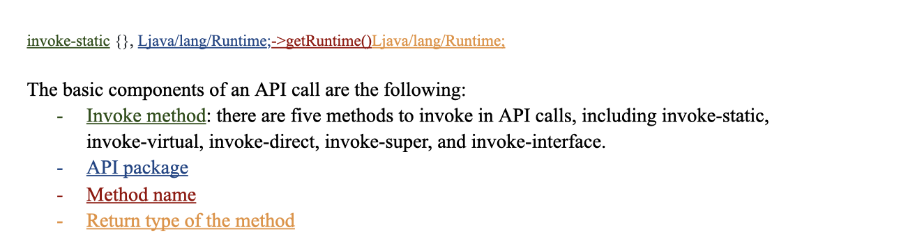

# DSC180 Malware Detection 

## Introduction 
As the internet techniques are growing at a fast speed nowadays, people are starting to worry about their data safety. Since many of us will store our important information on our cellphones, we need to find an appropriate way to secure our cell phone away from malwares. It is also large companies’ like Google who offer a third open market to ensure the data security of their customers. Therefore, more researchers are participating in the research area of detecting malwares. There is a new method called HinDroid, which finds out the relationships between applications for malware detection. However, while using the HinDroid, some shortages of the model have been found. For example, the HinDroid only uses parts of the features contained in the smali file. But there are more useful features that can help detect malwares after doing analysis. There are also other models which relate to NLP that are popular in the malware detection research domain. Therefore, in this report, we will compare the performance of HinDroid, Word2vec, Node2vec, and Metapath2vec.

## Data Generating Process
### Data Source 
The data source is called AnDroid Malware Dataset (AMD). The dataset is published in 2017 by the Argus Lab from the University of South Florida. This data source is used by many other malware detection papers and widely used in the research domain. 
### Data Description 
The original source is the APK(Android Application Package), which can be decompiled by Apktool. After converting the APK package into different files, we select smali files specifically for detecting malwares. Smali files are a type of file converted from the original java code. The researchers considered that the malicious actions are contained in the smali file and it is more meaningful to use smali files. We randomly choose 200 malwares and 200 benigns from the dataset.
### Smali File 
In order to analyze the smali files, we should understand the structure of it. Therefore, here is the description of the smali files and the features contained in the smali files.

### API Calls
In order to understand which part of the smali files do the malicious action, we put our attention on API (Application Programming Interface) calls. There are four main components in an API call.

### Data Extraction 
After understanding the data structure of the data source and the exact data section we want to focus on, we start the data extraction process. We decide to use api name, class type, package type, code block number, method type, return type, and invoke type to be our features. Those features almost include every kind of information we can get from the smali file. In addition, we also do some EDA(Exploratory Data Analysis) to make sure every feature we get is distributed differently among different types of applications. Therefore, the features can present the original data and they are useful hints to detect malwares.
### Database
We design a special database to store the data we get. Since the main feature is the api, there are over 2 millions unique apis and more than 50 millions apis appeared in different smali files. Separated csv files and unique ids are used to store the specific unique string values and represent the string value. Then, in the main csv files, we store the unique ids from different references. This will reduce the space and time. The description of our database is appended below.

## Model 
### HinDroid
HinDroid is the baseline model we use for our report. It contains different types of kernels and the meaning behind each kernel is different. It uses the features we extract from the data generating process to build some matrices. Each matrix shows a type of relationship between apis or applications. By choosing different types of matrices we want to combine together, we get the kernel we have. Then we will be able to use the kernels for malware detection. 
The four types of matrices are: A, B, P, and I matrices. 
- A matrix shows the connection among apis and applications. The value within the A matrix will be one if the application contains the api.
- B matrix shows the connection between apis. The value within the B matrix shows whether two apis are contained in the same code block.
- P matrix also shows the connection between apis. The value within the P matrix shows whether two apis use the same package.
- I matrix shows the connection within the apis. The value within the I matrix shows whether two apis use the same invoke type.
Currently, due to the large size of the unique apis we get, we are not able to calculate out the I matrix yet. Therefore, the kernel we have now is $AA^{T}$, ABA^t, APA^t, and APBP^tA^t. 
